# 🚦 Smart Railway Gate with ESP32 & Telegram Bot

[](https://www.arduino.cc/en/software)
[](https://www.espressif.com/en/products/socs/esp32)
[](https://core.telegram.org/bots)
[](LICENSE)


A **real-time, obstacle-aware Smart Railway Gate System** powered by **ESP32**, featuring **dual servo gates, ultrasonic sensors, buzzer alerts, LEDs**, and a **Telegram bot interface** for remote control & monitoring.  

> ⚡ Designed to reduce human error and enhance safety — especially in rural or unmanned railway crossings.  


---

## 📸 Demo

GIF here in `images/lv_0_20250617213336.gif`_  


---

## ✨ Features  

- 🟢 **Automatic Gate Control** with servo motors  
- 📡 **Remote operation via Telegram bot** (`/open`, `/close`, `/status`)  
- 🚧 **Obstacle detection** (prevents closing if objects detected within 20cm)  
- 🔊 **Smart buzzer** with increasing beep frequency during gate movement  
- 🚦 **LED Indicators** → Red (Closed/Closing), Green (Open/Opening)  
- 📩 **Instant Alerts** on Telegram (e.g., *“Object detected”*)  
- 📺 **LCD Display** with scrolling messages for real-time status  

---

## 🚀 Advanced Features (Pro-Grade Enhancements)  

- 🌐 **Web Dashboard** → ESP32 hosts a web server to monitor gate status, control actions, and view sensor data in real time.  
- 📂 **Data Logging** → Log every gate action & object detection to SD card or cloud services (Firebase/ThingSpeak).  
- 🔐 **Secure Multi-User Control** → Only authorized Telegram chat IDs can send commands; supports multiple admins.  
- ⚠️ **Emergency Override** → Physical button allows manual open/close if Wi-Fi fails, with override alert on LCD & Telegram.  
- ⏳ **Scheduled Operations** → Auto-open/close gates at preset times using NTP/RTC sync (useful for fixed train schedules).  
- 🔋 **Power Backup Mode** → Battery support with low-battery alerts sent via Telegram.  
- 📶 **Offline Fail-Safe** → System continues in automatic sensor mode if Wi-Fi disconnects; resumes Telegram when back online.  
- 🧠 **Future Upgrade: AI Object Detection** → ESP32-CAM + lightweight ML model to distinguish vehicles, people, or animals near tracks.  
- 📍 **Optional GPS Integration** → Gate alerts include location data for field deployment & safety audits. 

---

## 📦 Components Used

| Component                    | Quantity | Description                                      |
|-----------------------------|----------|--------------------------------------------------|
| ESP32                       | 1        | Main controller board                            |
| Servo Motors (MG90s/SG90)   | 2        | To move the gates up/down                        |
| Ultrasonic Sensors (HC-SR04)| 2        | For obstacle detection on both sides             |
| Buzzer                      | 1        | For warning beep (increasing pitch)              |
| LEDs (Red + Green)          | 2        | Red = Gate Closing/Closed, Green = Opening/Open  |
| 220Ω Resistor               | 2        | Current limiter for LEDs                         |
| 100μF Capacitor             | 1        | Power stabilizer for servos                      |
| Breadboard + Wires          | Many     | For prototyping                                  |
| Internet-connected WiFi     | 1        | Required for ESP32 to talk to Telegram           |

---

## 💬 Telegram Bot Setup

1. **Create Bot**
   - Open Telegram → Search `@BotFather`
   - Type `/newbot`
   - Give it a name and username
   - You'll get a **BOT TOKEN** like:
     ```
     123456789:AAHfkGuwSdf1asfasdf...
     ```

2. **Get Chat ID**
   - Open your Telegram bot and **send any message**
   - Visit:  
     [https://api.telegram.org/botYOUR_TOKEN/getUpdates](https://api.telegram.org/botYOUR_TOKEN/getUpdates)
   - Look for:
     ```json
     "chat": { "id": 123456789, ... }
     ```
   - That `id` is your **Chat ID**

---

## 🧠 Working Principle

- When `/open` or `/close` is received on Telegram:
  - Servo moves slowly (2.5–3.8s) to open or close the gate
  - Buzzer starts with slow beeps and increases frequency
  - LED glows:
    - 🔴 while gate is closing or closed
    - 🟢 while gate is opening or open
- Before closing:
  - Both ultrasonic sensors check for objects within 20cm
  - If object found → `Gate doesn't close`, Telegram sends `Object detected`
- `/status` shows current gate state and whether an object is detected.

---

 Component                   | Quantity | Notes                                                      |
|----------------------------|----------|------------------------------------------------------------|
| ESP32                      | 1        | WiFi-capable microcontroller                               |
| Servo Motor (MG90s/SG90)   | 2        | Controls gate movement (GPIO 13 & 14)                      |
| Ultrasonic Sensor (HC-SR04)| 2        | For obstacle detection (TRIG: GPIO 25/32, ECHO: GPIO 33/35)|
| Buzzer                     | 1        | Gate movement alert (GPIO 12)                              |
| LED - Red                  | 1        | Lights when gate is closing/closed (GPIO 26)              |
| LED - Green                | 1        | Lights when gate is opening/open (GPIO 27)                |
| 220Ω Resistor              | 2        | For limiting current to LEDs                               |
| 100μF Capacitor            | 1        | Stabilizes power near servo motors                         |
| I2C 16x2 LCD (addr: 0x27)  | 1        | Displays gate status with scrolling messages              |
| Breadboard, wires          | Many     | General purpose wiring                                     |

---

## 🔌 Pin Configuration (ESP32)

| Function         | GPIO Pin |
|------------------|----------|
| Servo 1          | 13       |
| Servo 2          | 14       |
| Buzzer           | 12       |
| Red LED          | 26       |
| Green LED        | 27       |
| Ultrasonic 1 TRIG| 25       |
| Ultrasonic 1 ECHO| 33       |
| Ultrasonic 2 TRIG| 32       |
| Ultrasonic 2 ECHO| 35       |
| I2C SDA/SCL      | 21,22    |

> Note: Use capacitor to prevent servo resets due to voltage drops.

---

## ⚙️ Installation

1. Install **Arduino IDE**
2. Install ESP32 board via Board Manager
3. Install required libraries:
   - `WiFi.h`
   - `HTTPClient.h`
   - `Servo.h`
   - `NewPing.h`
4. Open `/src/main.ino` and update these:
   ```cpp
   const char* ssid = "YOUR_WIFI_SSID";
   const char* password = "YOUR_WIFI_PASSWORD";
   String botToken = "YOUR_BOT_TOKEN";
   String chatId = "YOUR_CHAT_ID";


---

---

## 🗺️ Roadmap  

```mermaid
%% Roadmap Timeline
timeline
    title Smart Railway Gate Project Roadmap
    section Phase 1 – Core System (✅ Completed)
      Servo-based gate movement : Done
      Obstacle detection with ultrasonic sensors : Done
      LED + Buzzer indicators : Done
      Telegram Bot commands (/open, /close, /status) : Done
      LCD display with scrolling messages : Done

    section Phase 2 – Enhancements (🔄 In Progress)
      Web dashboard (ESP32 web server) : Active
      Data logging (SD/Cloud) : Planned
      Secure multi-user Telegram access : Planned
      Emergency override button + alert : Planned
      Scheduled auto-gate operations : Planned

    section Phase 3 – Advanced Upgrades (🔮 Future)
      Power backup with low-battery alerts : Planned
      Offline fail-safe mode : Planned
      AI-based object detection (ESP32-CAM + ML) : Planned
      GPS-enabled alerts with location : Planned
      Cloud predictive maintenance & analytics : Planned


---

```




<p align="center">  
  Made with ❤️ by <a href="https://github.com/ikrishanaa">Krishana Yadav</a>  
  <br/>  
  🚦 Smart Railway Gate System | ESP32 + Telegram Bot  
</p>
